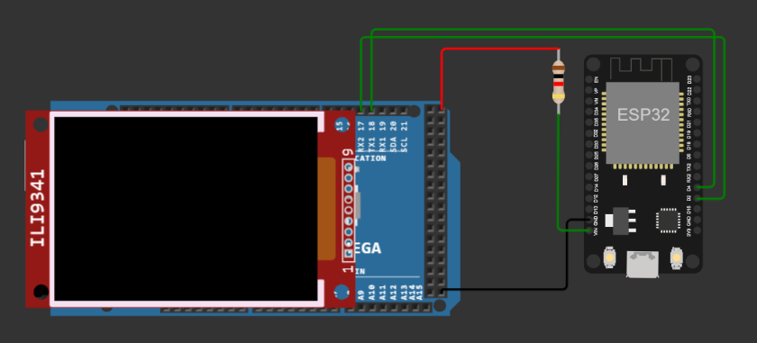

# MQTT Pager
Thilo Drehlmann, Gerrit Koppe

---

#### Inhaltsverzeichnis:

* Rückblick auf bisheriges Projekt
* Generelle Idee
* Umsetzungsstrategie
* Kosten
* Probleme bei der Durchführung
* Schaltplan
* Live Demo
  
---

### Rückblick auf bisheriges Projekt
* Pagersystem
* Nachrichten wurden auf Touchscreen angezeigt und eingegeben
* Kommunikation zwischen zwei Arduinos mittels NRF24 Modulen

---
### Generelle Idee
Ziel des Projektes war es, die bestehende RF Kommunikation der beiden Arduinos auf eine MQTT gestützte Kommunikation mithilfe von ESPs umzustellen, gemäß des abschließenden Ausblicks unserer letzten Präsentation.

---

### Umsetzungsstrategie
* Kommunikation zwischen ESP und Broker herstellen
  * Zunächst Unidirektional, dann Bidirektional
* Datenübertragung zwischen Arduino und ESP herstellen
* Funktionen des Arduinos überladen, sodass diese mit dem ESP arbeiten können
* Empfangene Daten vom Broker an Arduino weitergeben und anzeigen

---

### Kosten
| Bauteil | Kosten  |
| ------- | ------- |
| ESP8266 | 7,95€x2 |

---

### Probleme bei der Durchführung
* Projekt sehr umfangreich für verfügbare Zeit
  * Wir hatten daheim keinen MQTT Broker
  * Einen eigenen Broker aufzusetzen erwies sich als schwieriger als gedacht, nahm viel Zeit in Anspruch
* SoftwareSerial Library vom Arduino lief nicht gut
  * Wir hatten glücklicherweise den MEGA, mit genug Hardware Serial Ports
* WLAN in der Schule quasi nicht existent

---

### Schaltplan

---

# Live Demo
